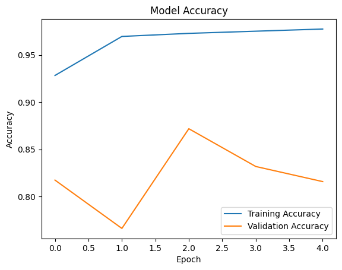
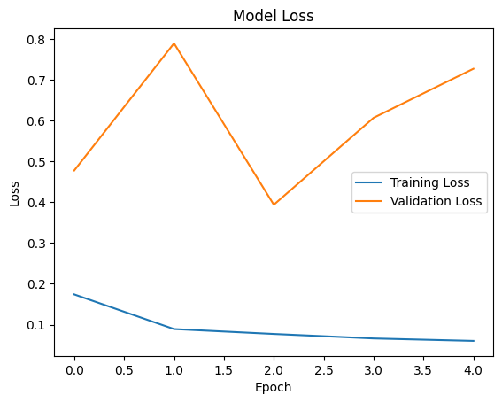

# Pneumonia Detection — Chest X-Ray Classifier


A transfer-learning image classifier that detects pneumonia from chest X-ray
images, built with TensorFlow/Keras and MobileNetV2. Developed as a deep
learning coursework/exhibition project.

## Overview

The notebook downloads the public
[Chest X-Ray Images (Pneumonia)](https://www.kaggle.com/datasets/paultimothymooney/chest-xray-pneumonia)
dataset from Kaggle, fine-tunes a MobileNetV2 backbone for binary
classification (`NORMAL` vs. `PNEUMONIA`), and evaluates the result with
accuracy/loss curves and a confusion matrix / classification report.

## Features

- Automatic dataset download via `kagglehub` (no manual upload needed)
- Transfer learning on `MobileNetV2` (ImageNet weights, frozen backbone)
- Binary image classification with a lightweight classification head
  (`GlobalAveragePooling2D` → `Dense(64, relu)` → `Dropout(0.3)` → `Dense(1, sigmoid)`)
- Training/validation accuracy and loss curves
- Confusion matrix and classification report on the held-out test set
- Single-image inference cell for manual upload/testing (Colab)

## Tech Stack

| Category        | Technology                     |
|------------------|---------------------------------|
| Language          | Python                         |
| Deep Learning     | TensorFlow / Keras (MobileNetV2) |
| Data              | kagglehub, Kaggle Chest X-Ray Pneumonia dataset |
| Evaluation        | scikit-learn (confusion matrix, classification report) |
| Visualization     | Matplotlib                     |
| Environment       | Google Colab / Jupyter Notebook |

## Architecture

The model is a classic **transfer-learning head on a frozen backbone**:

```
Input (224×224×3)
       │
       ▼
MobileNetV2 (ImageNet weights, include_top=False, trainable=False)
       │  — acts as a fixed feature extractor
       ▼
GlobalAveragePooling2D
       │
       ▼
Dense(64, activation="relu")
       │
       ▼
Dropout(0.3)
       │
       ▼
Dense(1, activation="sigmoid")  ──►  P(pneumonia)
```

**Why this design:**
- **Frozen MobileNetV2 backbone** — with only 5,216 training images, training
  a CNN from scratch would overfit badly. Freezing ImageNet-pretrained
  weights and only training a small head lets the model reuse general-purpose
  visual features (edges, textures, shapes) instead of relearning them.
- **MobileNetV2 specifically** — a lightweight architecture (depthwise
  separable convolutions), which keeps training fast and inference cheap
  enough to run in a Colab session without a dedicated GPU budget.
- **Single sigmoid output** — this is a binary classification problem
  (`NORMAL` vs. `PNEUMONIA`), so a single sigmoid unit with a 0.5 decision
  threshold is sufficient; no need for a 2-unit softmax head.
- **Dropout(0.3)** before the output layer — regularizes the small
  classification head, which is the only trainable part of the network.

## Folder Structure

```
Pneumonia_Detection/
├── ChestX-RayProject_123.ipynb   # Main notebook: data, training, evaluation
├── requirements.txt              # Python dependencies
├── docs/
│   └── images/                   # Real training curves (extracted from notebook outputs)
├── .github/workflows/            # CI: notebook validation
├── .gitignore
├── LICENSE
└── README.md
```

> Note: the dataset itself (`chest_xray/`) is **not** included in this
> repository. It is downloaded automatically at runtime via `kagglehub`.

## Requirements

- Python 3.10+
- A Kaggle account is **not** required to run the notebook in Colab (the
  dataset is served through the Colab/kagglehub cache), but running locally
  may require a Kaggle API token — see the
  [kagglehub docs](https://github.com/Kaggle/kagglehub) if you hit an
  authentication prompt.

## Installation

```bash
git clone <this-repo-url>
cd Pneumonia_Detection
pip install -r requirements.txt
```

## Usage

1. Open `ChestX-RayProject_123.ipynb` in Google Colab or Jupyter.
2. Run the cells top to bottom:
   - **Cell 1** downloads the dataset via `kagglehub`.
   - **Cells 2–4** build the `train`/`test` image datasets (224×224, batch size 32) and normalize pixel values to `[0, 1]`.
   - **Cells 5–6** build and compile the MobileNetV2-based model (Adam optimizer, binary cross-entropy loss).
   - **Cell 7** trains the model for 5 epochs, validating against the test split each epoch.
   - **Cell 8** evaluates final test accuracy/loss.
   - **Cells 9–10** plot the accuracy and loss curves shown below.
   - **Cell 11** lets you upload a custom X-ray image for a live prediction (Colab file upload widget).
   - **Cell 12** prints a confusion matrix and classification report on the full test set.

## Training Process

| Setting            | Value                          |
|---------------------|---------------------------------|
| Input size           | 224×224×3                      |
| Batch size            | 32                              |
| Optimizer             | Adam                            |
| Loss                  | Binary cross-entropy            |
| Epochs                | 5                                |
| Trainable parameters  | Only the classification head (MobileNetV2 backbone frozen) |
| Train / test split    | 5,216 / 624 images               |

## Performance

These figures are the actual outputs from the notebook's saved run (not
re-generated or estimated).

### Training Curves

| Accuracy | Loss |
|---|---|
|  |  |

### Test Set Results

| Metric              | Value   |
|---------------------|---------|
| Final test accuracy | 81.57%  |
| Final training accuracy | 97.76% |

**Confusion matrix** (rows = actual, columns = predicted; `0 = NORMAL`, `1 = PNEUMONIA`):

```
[[119 115]
 [  0 390]]
```

**Classification report:**

```
              precision    recall  f1-score   support

         0.0       1.00      0.51      0.67       234
         1.0       0.77      1.00      0.87       390

    accuracy                           0.82       624
   macro avg       0.89      0.75      0.77       624
weighted avg       0.86      0.82      0.80       624
```

The model never misses a pneumonia case in this run (recall = 1.00 for class
`1.0`) but over-predicts pneumonia on some normal X-rays (recall = 0.51 for
class `0.0`), which shows up as the accuracy/loss curves diverging after
epoch 2 — a sign of mild overfitting once training accuracy pulls away from
validation accuracy. See **Future Improvements** below for how this could be
addressed.

### Example Output

A real single-image prediction from the notebook's manual-upload cell:

```
Uploaded: NotNormalChest1.jpeg
Prediction probability: 99.93%
Result: Pneumonia Detected
```

## Future Improvements

- Unfreeze and fine-tune the top layers of MobileNetV2 for a few epochs to close the train/val accuracy gap.
- Add data augmentation (rotation, zoom, flips) to reduce overfitting.
- Track experiments with more epochs and early stopping.
- Save the trained model (`.keras`/`.h5`) and add a standalone inference script outside of Colab.
- Add a proper train/validation/test split (the dataset's original validation split is very small).
- Add a class-weighted loss or threshold tuning to raise the low recall on `NORMAL` cases.

## Screenshots

Training curves are included above under **Performance**. There is currently
no additional UI to screenshot (this is a notebook-based project).

## License

Distributed under the [MIT License](./LICENSE).

## Author

**Abdullah**
